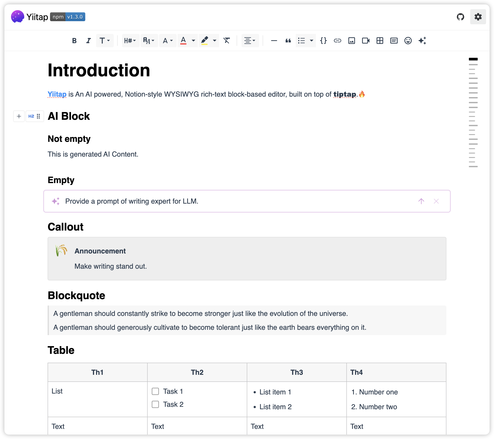

# Yiitap

Yiitap is an AI powered, Notion-style WYSIWYG rich-text block-based editor, built on top of [tiptap](https://tiptap.dev).🔥

<p align="center">
    <a href="https://github.com/pileax-ai/yiitap/actions/workflows/build.yml" alt="Build Status">
        </a>
    <a href="https://www.npmjs.com/package/@yiitap/vue" alt="Version">
        </a>
    <a href="https://npmcharts.com/compare/@yiitap/vue?minimal=true" alt="Downloads">
        </a>
    <a href="https://github.com/badges/shields/pulse" alt="Activity">
        </a>
    <a href="https://github.com/pileax-ai/yiitap/blob/main/LICENSE" alt="License">
        </a>
</p>

## Features

🚀 **Supports Vue & React** – Seamless integration with both frameworks.  
📝 **Modern Notion-style editor** – Clean, intuitive, and distraction-free.  
🔧 **Highly customizable & extensible** – Built on **Tiptap** & **ProseMirror**.  
🤖 **AI-powered** – Smart features to boost productivity.  
🧩 **Block-based editing** – Manipulate content via **bubble, floating, main, or side menus**.  
✨ **Rich feature set** – Includes **15+ custom extensions** & **50+ UI components**.  
🌗 Light & Dark mode.  
🆓 MIT Licensed.

## Quick start

- [Guide to Yiitap](https://yiitap.pileax.ai/guide/getting-started)
- [Live Demo](https://yiitap.pileax.ai/demo/vue)
- Full Example: [Live](https://pileax-ai.github.io/yiitap/) | [Source](https://github.com/pileax-ai/yiitap/blob/main/apps/vue/src/components/Demo.vue)

For more detailed information, make sure to check out our [documentation](https://yiitap.pileax.ai/guide/getting-started). If you encounter any problems or have suggestions, please open an issue.

## Screenshots



## Development
### Install dependencies
```shell
pnpm install
```

### Run demo
```shell
pnpm dev
```

### Build
```shell
pnpm build
```

## Acknowledgements

- [Tiptap](https://github.com/ueberdosis/tiptap) & [ProseMirror](https://github.com/ProseMirror/prosemirror): Yiitap is built on top of Tiptap and ProseMirror.
- [BlockNote](https://github.com/TypeCellOS/BlockNote): A React Rich Text Editor that's block-based (Notion style) and extensible..

## License
The MIT License (MIT). Please see [License File](LICENSE) for more information.
